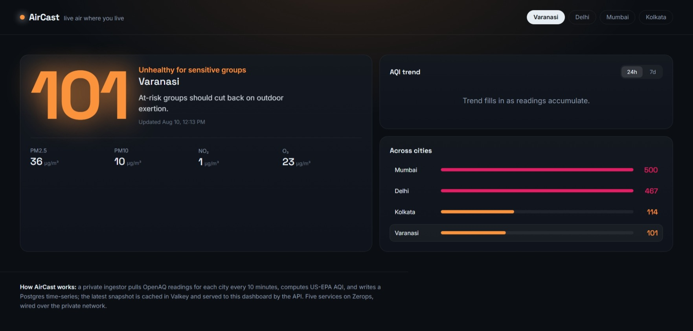

# AirCast — live air where you live

**AirCast turns India's public air-quality data into live, plain-language health alerts for your city.** Pick your city, see the current AQI, where it's heading, and what to actually do about it today.


<!-- Take a screenshot of the running dashboard and save it to docs/screenshot.png -->

---

## What it does

- Live AQI for Indian cities (Varanasi first), computed with the US-EPA formula from PM2.5/PM10.
- A plain-language health line for the current level ("keep outdoor time short; mask up if you head out").
- 24h / 7d trend, pollutant breakdown, and a cross-city comparison.
- Threshold alerts: subscribe a city and get flagged when air crosses your limit.

## How Zerops is used

Five services, wired over the project's private network — only the first two are public:

| Service    | Role                                                            |
|------------|-----------------------------------------------------------------|
| `app`      | React/Vite dashboard (public, no login)                         |
| `api`      | Hono API — current/history/forecast/subscribe (public)          |
| `ingestor` | Private worker — pulls OpenAQ every 10 min, computes AQI        |
| `db`       | Managed PostgreSQL — cities, stations, readings time-series     |
| `cache`    | Valkey — latest-snapshot cache + alert queue                    |

Infra is declared in `import.yaml`; build/deploy for the three code services in `zerops.yaml`.

## Architecture

```
OpenAQ ──▶ ingestor (private, cron 10m) ──▶ Postgres (time-series)
                         │                      ▲
                         └──▶ Valkey (cache) ───┘
                                    ▲
        app (SPA) ──▶ api ──────────┘   (api reads cache-first, DB fallback)
```

## Run on Zerops

1. `zcli project project-import import.yaml` (or paste it into the GUI importer).
2. On `ingestor`, set `OPENAQ_API_KEY` as a **secret env var** (free key from openaq.org).
3. On `app`, set build env `VITE_API_URL` to the `api` service's public URL.
4. Push the repo (or connect it); `zerops.yaml` at the root builds all three code services.
5. Open the `app` public URL. First readings appear within ~10 minutes (ingestor runs once on boot).

## Local dev (optional)

Each app: `npm install`, then `npm run build` / `npm run dev`. Requires reachable Postgres + Valkey and the env vars above.

## AI tools used

_Disclose everything you used here, e.g.:_ ZCP + Claude Code for scaffolding and wiring; Claude for the AQI logic and README. All architecture and Zerops decisions are my own and I can explain them.

## Data

Air-quality readings from the [OpenAQ](https://openaq.org) public API. AQI computed locally with US-EPA PM2.5 breakpoints.
